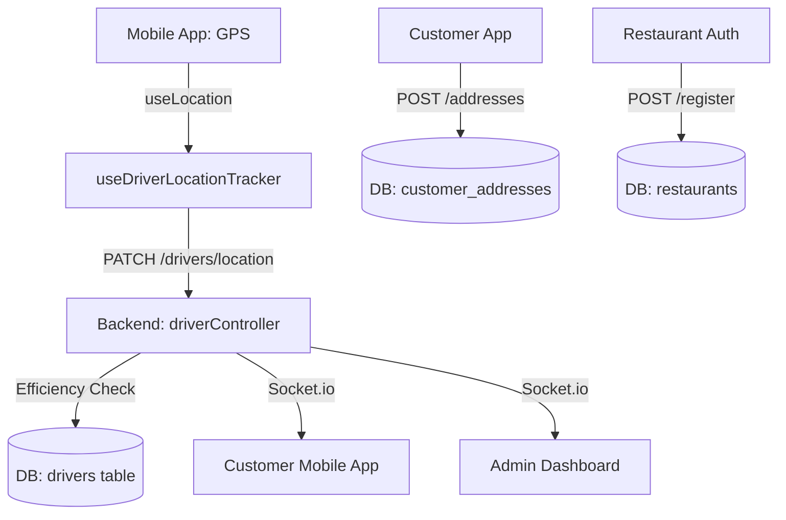

# Location Data Documentation

This document provides a comprehensive analysis of how location data is handled within the Delivery Base project, covering triggers, data flow, database schema, and technical implementation details.

## 1. Overview
Location data is central to the delivery ecosystem, used for:
- Tracking drivers in real-time.
- Calculating delivery ETAs and distances.
- Finding nearby restaurants for customers.
- Managing driver availability and proximity for order assignments.

---

## 2. Location Triggers (When & Why)

### 2.1 Driver Tracking
Driver location updates are primarily driven by the mobile application using the `useDriverLocationTracker` hook.

| Mode | Trigger Frequency | Reason |
| :--- | :--- | :--- |
| **Idle (Available)** | Every 8 minutes | Updates current position for order matching; saves battery. |
| **Active Delivery** | Every 4 minutes | Provides real-time tracking for customers and accurate ETAs. |
| **Manual Action** | On status change | Ensures the system has the latest position when a driver goes online. |

### 2.2 Customer Addresses
Location is captured when a customer:
- Adds a new address via the mobile app.
- Edits an existing address.
- Uses "Current Location" to pin their delivery spot.

### 2.3 Restaurants
Location is captured during:
- **Registration:** Restaurants provide their GPS coordinates to define their pickup point.
- **Profile Updates:** Admins or owners can adjust the restaurant's pin location.

---

## 3. Database Schema

### 3.1 Core Tables
Location data is stored across several tables to support different features:

| Table | Fields | Description |
| :--- | :--- | :--- |
| `drivers` | `current_latitude`, `current_longitude` | Latest known position of the driver. |
| `driver_location_history` | `latitude`, `longitude`, `recorded_at` | Historical breadcrumbs of driver movement (Audit/Analysis). |
| `restaurants` | `latitude`, `longitude` | Fixed location of the restaurant for pickup. |
| `customer_addresses` | `latitude`, `longitude` | Precise delivery coordinates for an address. |
| `deliveries` | `pickup_lat/lng`, `delivery_lat/lng` | Snapshots of locations at the time of order creation. |

---

## 4. Technical Implementation

### 4.1 Mobile App (Frontend)
- **`useLocation` Hook:** Interfaces with the native `SimpleLocation` module (Kotlin/Swift) for Bridgeless RN 0.83 compatibility.
- **`useDriverLocationTracker` Hook:** Manages the lifecycle of periodic updates based on the driver's state (`isAvailable`, `isOnDelivery`).
- **Geocoding:** Uses `geocodingService` to convert GPS coordinates into human-readable place names for the UI, with an in-memory cache to reduce API calls.

### 4.2 Backend API (Data Flow)
1.  **Endpoint:** `PATCH /api/v1/drivers/location`
2.  **Efficiency Check:** The backend compares the new coordinates with the last stored ones. It only writes to the database if the movement exceeds **~11 meters** (0.0001 degree change).
3.  **Real-time Broadcast:** If the driver has an active order, the backend triggers a socket event (`emitDriverLocationUpdate`) to notify the customer and restaurant.

### 4.3 Advanced Tracking (Delivery-Specific)
The system contains a specialized service `deliveryTrackingService.js` that:
- Records history in `driver_location_history`.
- Calculates **Haversine Distance** to the destination.
- Estimates **ETA** based on remaining distance.

> **Note:** Currently, the mobile app defaults to the generic driver update endpoint. Transitioning to the delivery-specific endpoint (`/api/v1/deliveries/:id/location`) would enable detailed historical tracking and ETA calculations.

---

## 5. Usage in Business Logic

### 5.1 Order Matching (Nearest Driver)
The `driverAssignmentService.js` uses stored location data to find the best driver for an order:
1.  **Delivery Distance:** Calculates distance between Restaurant and Customer Address.
2.  **Vehicle Filtering:** If delivery distance is > 3km, slow vehicles (bicycles/scooters) are filtered out.
3.  **Pickup Distance:** Calculates distance between the Restaurant and available Drivers' `current_latitude/longitude`.
4.  **Scoring:** Drivers are ranked based on:
    - **Pickup Distance** (Lower is better).
    - **Vehicle Type** (Motorcycles get a speed bonus in traffic).
    - **Long Haul Compatibility** (Cars/Vans preferred for distances > 10km).

### 5.2 Real-time Tracking (Map)
- **Customer App:** Connects to a socket room `order:{orderId}` to receive `delivery:location-update` events.
- **Admin Panel:** Uses the `GET /api/v1/drivers/available` endpoint with `latitude/longitude` query params to visualize drivers on a map and filter them by radius.

---

## 6. Summary of Data Movement

---

## 6. Logic & Constants
- **Movement Threshold:** `0.0001` degrees (~11 meters).
- **Idle Interval:** `8 minutes`.
- **Delivery Interval:** `4 minutes`.
- **Coordinate Precision:** `DECIMAL(10, 8)` for Latitude, `DECIMAL(11, 8)` for Longitude.
